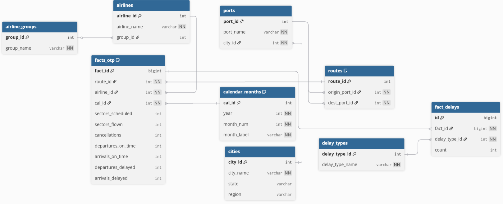

# SkyTrack Insights ✈️

An analytical system for exploring the punctuality of Australian domestic airlines.

##  Project Structure
SkyTrack-Insights/
├── datasets/
│ └── otp_time_series_web.csv # raw dataset
├── erd/
│ └── erd.png # ER diagram
├── sql/
│ └── queries.sql # 10 analytical SQL queries
├── src/
│ └── main.py # Python script for running queries
└── README.md # project description

##  Database
The project uses **PostgreSQL**.  
Main tables:
- `cities`, `ports`, `routes`
- `airline_groups`, `airlines`
- `calendar_months`
- `facts_otp` (fact table, ~80k rows)
- `delay_types`, `fact_delays`

### ERD


## ⚙️ Installation & Usage

### 1. Clone the repository
```bash
git clone https://github.com/JeongSydkk/SkyTrack-Insights.git
cd SkyTrack-Insights
pip install psycopg2-binary tabulate
DB_CONFIG = {
    "dbname": "otp_analysis",
    "user": "postgres",
    "password": "YOUR_PASSWORD",
    "host": "localhost",
    "port": 5432
}
python src/main.py
The file sql/queries.sql
 contains 10 analytical queries.
Examples include:

Top 10 airlines by on-time departure rate

Top 10 routes with the highest delay percentage

Cancellation rates by airline

Delay seasonality by month
Example Output
Yearly trend of Qantas flights
=== Query 1 ===
+---------------------+-------------+
| airline_name        |   pct_ontime|
+---------------------+-------------+
| Bonza               |        99.12|
| Jetstar             |        33.37|
| Tigerair Australia  |        31.44|
| Rex Airlines        |        27.71|
...

 Technologies Used

PostgreSQL

pgAdmin 4

Python 3.13

psycopg2

tabulate

Git & GitHub
